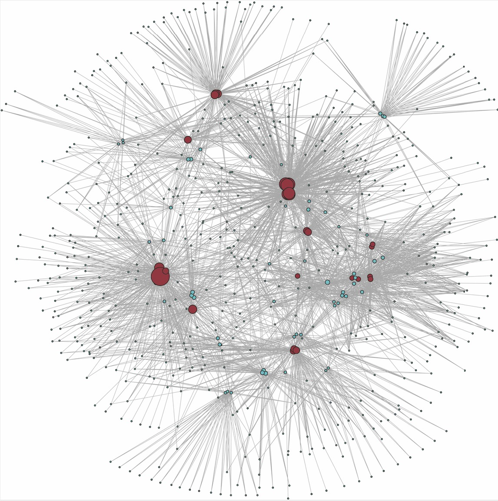
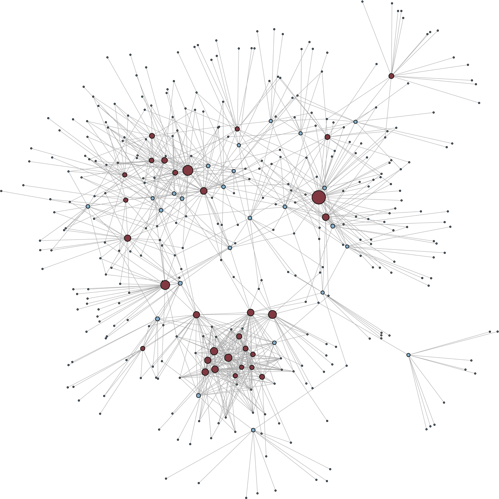
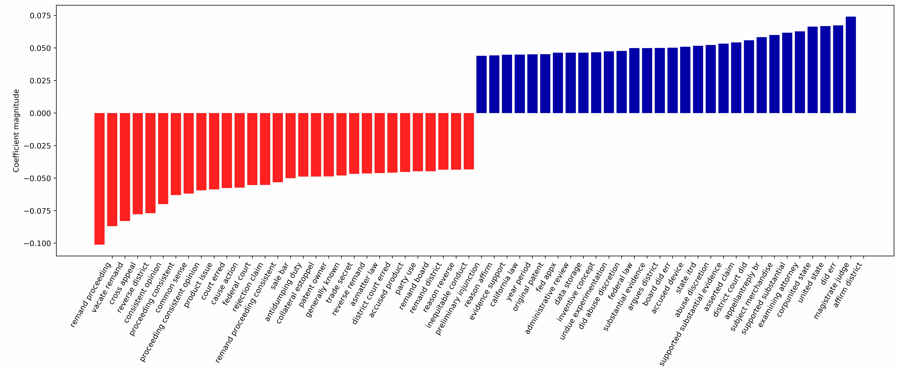

## Network Visulization and Predictive Modeling on 854 Legal Court Cases

[TOC]

### 1. Extract opinion and meta information from raw text data

| `.ipynb` notebook          | Description                                              |
| -------------------------- | -------------------------------------------------------- |
| `Full Dataset Merge.ipynb` | Merge the 854 cases dataset                              |
| `Edge and Node List.ipynb` | Create edge and node list                                |
| `Full Extractions.ipynb`   | Extract author, judge panel, opinion text                |
| `Clean Opinion Text.ipynb` | Remove references and special characters in opinion text |

### 2. Datasets 

| Dataset               | Description                                                  |
| --------------------- | ------------------------------------------------------------ |
| `amy_cases.json`      | large dictionary {file name: raw text} for 854 cases, from Lilian's PDF parsing |
| `full_name_text.json` | convert `amy_cases.json` key value pair to two list: `file_name`, `raw_text` |
| `cite_edge.csv`       | edge list of citation                                        |
| `cite_node.csv`       | node list contains `case_code`, `case_name`, `court_from`, `court_type` |
| `extraction854.csv`   | full extractions include `case_code`, `case_name`, `court_from`, `court_type`, `result`, `author`, `judge_panel` |
| `decision_text.json`  | json file include `author`, `decision`(result of the case), `opinion` (opinion text), `cleaned_text` (cleaned opinion text) |
| `cleaned_text.csv`    | csv file contains allt the cleaned text                      |
| `predict_data.csv`    | cleaned dataset for NLP modeling predict court decision      |

### 3. Visulization using R

| R markdown file                           |                                               |
| ----------------------------------------- | --------------------------------------------- |
| `Full Network Graph.Rmd`                  | draw the full citation network                |
| `Citation Betwwen Nodes.Rmd`              | draw citation between all the available cases |
| `Clean Data For Predictive Modelling.rmd` | clean text data for predictive modeling       |

#### Full Citation Network (all cases and cited cases)

#### Citation Between Available Cases

### 4. Predictive Modeling using Python

| `ipynb` notebook                |                                                              |
| ------------------------------- | ------------------------------------------------------------ |
| `NLP Predictive Modeling.ipynb` | Try different preprocessing, and build a logistic regression to predict court decision. |

#### Visulization of the Bi-gram (words) with the strongest coefficient

