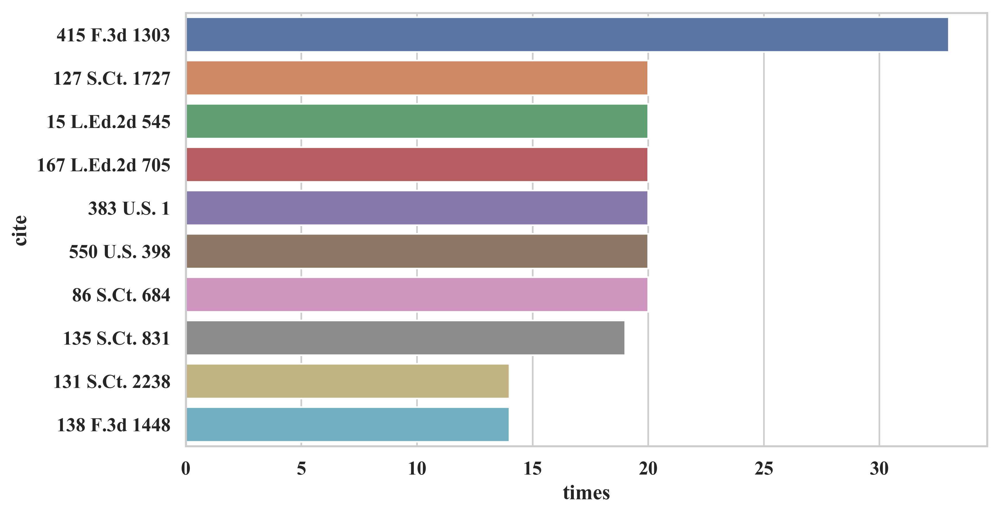
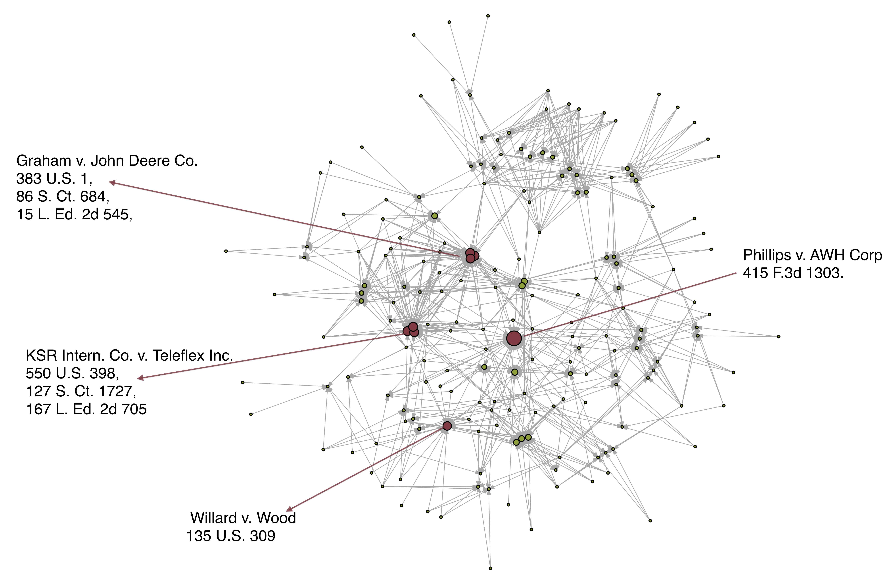

# Extraction from 159 Legal Court Documents

## 1. Process PDF documents using `Python` 

| Ipython Notebook                        | Description                                                  |
| --------------------------------------- | ------------------------------------------------------------ |
| `1.Extraction by LexNLP.ipynb`          | Extract meta inforation use `LexNLP` package.                |
| `2.Layer Analysis on Sigle File. ipynb` | Use `pdfminer` to extract the raw text and the *paragraph segamentation* in the PDF document. |
| `3.Patent Position by Layer.ipynb`      | Identify the position of patent number in extracted layers from PDF. |
| `4.Opinion and Author by Layer.ipynb`   | Extract opinion text, author, decisions from the layers list. |
| `5.Wrap up to Meta Data.ipynb`          | Store extracted meta data to `.json` or `.csv`               |
| `6.Visualize citation frequency.ipynb`  | Bar plot of the citation frequencies                         |

## 2. Data generated by `Python`

| File                    |                                                              |
| ----------------------- | ------------------------------------------------------------ |
| `pdf2text159.json`      | A dictionary of 3 list: `file_name`, `raw_text`, `layers`.   |
| `cite_edge159.csv`      | Edge list of citation network                                |
| `cite_node159.csv`      | Meta information of each case: `case_number`, `court`, `dates` |
| `reference_extract.csv` | cited cases in a list for every case, untidy format for analysis |
| `citation159`           | file citation pair, tidy format for calculation              |
| `regulation159`         | file regulation pair, tidy format for calculation            |

## 3. Analyze and Visualize using `R`

| File                               |                                 |
| ---------------------------------- | ------------------------------- |
| `Calculate Citation Frequency.Rmd` | Analyze `reference_extract.csv` |
| `Citation Network.Rmd`             | Analyze `cite_edge159`          |

## 4. Visulization Chart

#### Citation Frequency

#### Citation Network